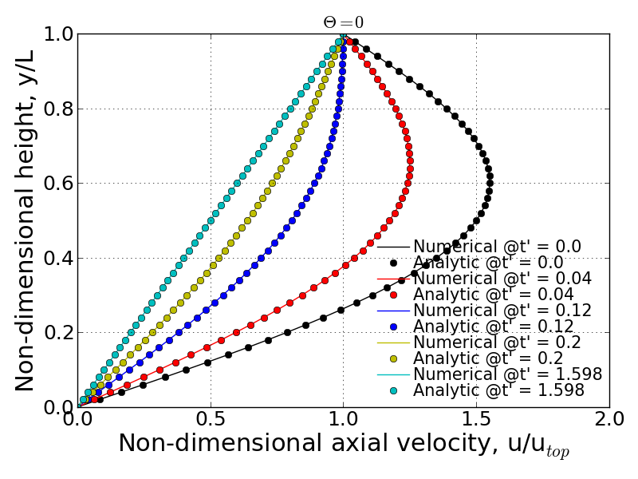
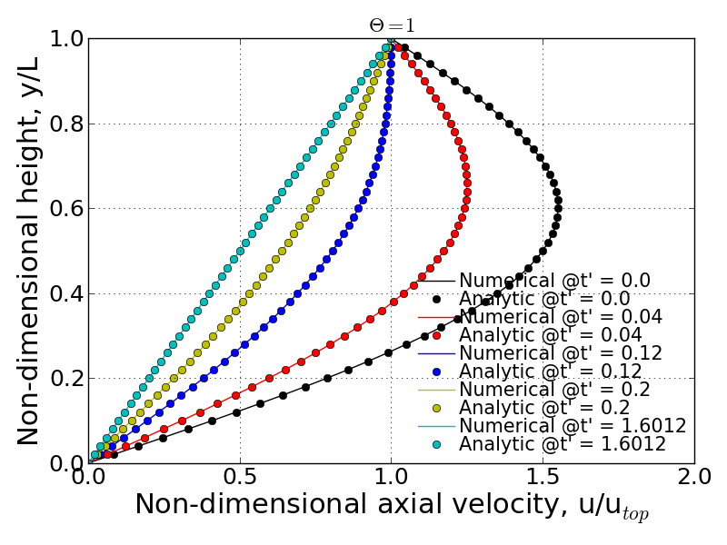

Results summary
===============

A) Result #1
------------

**Q.** Show the expression for :math:`\tau` that non-dimensionalizes the governing PDE. Show the non-dimensionalized form of the governing PDE.

- Non-dimensionalized variables:

  :math:`u' = \frac{u}{u_{top}}`, :math:`t' = \frac{t}{\tau}`, :math:`y' = \frac{y}{L}`

  where :math:`\tau = \frac{L^{2}}{\nu}`

- Non-dimensionalized governing PDE:

  :math:`\frac{\partial u'}{\partial t'} = \frac{\partial^{2}u'}{\partial y'^{2}}`

B) Result #2
------------

**Q.** Show the non-dimensionalized form of the time-dependent exact solution expression for the specified boundary and initial conditions given in this problem.

To find the time-dependent exact solution, we need to first find :math:`a_{n}` which satisfies the given initial velocity profile. The resolved form of :math:`a_{n}` is then re-written as:

.. math::
   a_{n} = \left\{\begin{matrix} 1 \text{  if } n = 1 \\ 0 \text{  if } n \neq  1 \end{matrix}\right.

Thus, applying the resolved :math:`a_{n}` into the given exact solution results in:

.. math::
   u'_{exact}(t',y') = y' + \text{sin}(\pi y') \text{exp}[-\pi^{2}t']

C) Result #3
------------

**Q.** Provide a brief description of the finite difference scheme (in non-dimensional form), the solution method used and exactly how the boundary and initial conditions are applied.

Given finite difference scheme has a weighting parameter :math:`\theta` to put an effect of implicit solution. If :math:`\theta` is equal to 1, the scheme becomes to fully implicit, otherwise, the scheme can be partially implicit or explicit (:math:`\theta` = 0). Rearranging the given finite difference equation leads to the following simplified form:

.. math::
   A_{j} u^{n+1}_{j+1} + B_{j} u^{n+1}_{j} + C_{j} u^{n+1}_{j+1} = D_{j}

where

.. math::
   A_{j} = -r \theta

   B_{j} = 1 + 2r\theta

   C_{j} = -r\theta

   D_{j} + r(1-\theta)\left \{ u^{n}_{j-1} - 2u^{n}_{j} + u^{n}_{j+1} \right \}

Here, the resulting equation has simplified coefficient :math:`r = \frac{\Delta t'}{\Delta y'^{2}}`.

For the boundary condition, non-slip condition is applied to both upper and bottom plates. Thus, :math:`y(0) = 0` and :math:`y(L)=1` remain unchanged while the inner point quantities varies during the transient phase. The initial condition described earlier can satisfy the given boundary condition here. The Thomas algorithm is set to unchange the boundary condition as the time varies.

D) Result #4
------------

**Q.** Show the expression used for calculating the RMS Error relative to the time-dependent exact solution. Also show the expression used for calculating the RMS Error relative to the steady-state exact solution. Also, give a statement of the criteria used to end the calculations.

In this project, two different types of RMS error formulation are used:

- RMS error relative to the exact time-dependent solution

  .. math::
     \text{RMS}_{\text{NSS}}(t) = \sqrt{\frac{1}{N} \sum_{\text{j}=2}^{\text{jmax}-1} \left [ \left ( u'_{exact,j}(t) - u'^{n} \right )^{2}  \right ]}

  where N is number of inner grid points.

- RMS error relative to the exact steady-state solution:

  .. math::
     \text{RMS}_{\text{SS}}(t) = \sqrt{\frac{1}{N} \sum_{\text{j}=2}^{\text{jmax}-1} \left [ \left ( u'_{exact,j}(t=\infty ) - u'^{n} \right )^{2}  \right ]}

- The convergence criteria is limited by the following relation:

  .. math::
     \text{RMS}_{\text{SS}}(t) \leqslant 1\times 10^{-7}

E) Result #5
------------

**Q.** For :math:`\theta = 0` and :math:`\text{jmax} = 51`, state the maximum value of :math:`\Delta t` for which a stable solution is obtained. Provide a semi-log plot of the RMS error (relative to the time-dependent exact solution) vs iteration number (using a :math:`\Delta t` for which the code is stable). Create a similar plot of the RMS error (relative to the steady-state exact solution) vs. iteration number.

**A.** Given conditions, the non-dimensional spatial step size results in :math:`\Delta y' = 0.0002`. Performing Von Neumann stability analysis on the given conditions give rise to the below time step criterion:

.. math::
   \Delta t' \leqslant \frac{\Delta y'^{2}}{4\left ( \frac{1}{2} - \theta \right )}

Thus, the maximum time step to stabilize the scheme is determined as :math:`\Delta t' = 0.0002`.

.. image:: ./images/RMSlog_5.png
   :width: 80%  

F) Result #6
------------

**Q.** For :math:`\theta = 0`, present a graph which clearly shows the progression of velocity profiles during the flow development when :math:`\text{jmax} = 51`. The plot should show the initial profile, final steady state profile and at least 3 other non-steady-state profiles (i.e. all on the same plot). Overlay the exact numerical velocity profiles on this plot for the same points in time. Create similar plots for :math:`\theta = 1/2` and :math:`\theta = 1`.

In this problem, the time step was employed as :math:`\Delta t'` = 0.0002 in order to have stable convergence for every :math:`\theta` cases. This time step was then applied to the other :math:`\theta` cases. As the following three figures show, the numerical solution well follows the analytical solution in both time and spatial domain.

1) :math:`\theta` = 0:

2) :math:`\theta` = 0.5

.. image:: ./images/Vel_6_theta0.5.png
   :width: 80% 

3) :math:`\theta` = 1

G) Result #7
------------

**Q.** Provides a comparison of the stability behavior of your solver to the stability analysis performed in Homework Assignment #3. Compute :math:`\text{jmax} = 51` cases with :math:`\theta = 0`, :math:`1/2`, and :math:`1` using various values of :math:`\Delta t` to explore the stability boundaries of your solver. Show and discuss whether or not your solver follows the theoretical stability behavior of these three numerical schemes.

**A.** From the HW#3's solution, the stability analysis can be summarized by:

- Unconditionally stable if :math:`\theta \geqslant \frac{1}{2}`

- Conditionally stable if :math:`0 \leqslant \theta < \frac{1}{2}`

In the case of conditionally stable scheme, the maximum time step can be determined by using below relation so that the scheme is stable with given :math:`\theta`.

.. math:: 
   \Delta t \leqslant \frac{\Delta y^{2}}{4\left ( \frac{1}{2}-\theta \right )}

1) :math:`\theta` = 0 (Fully explicit)
++++++++++++++++++++++++++++++++++++++

According to the above relation, for :math:`\theta = 0`, the maximum time step should be 0.0002 to make the scheme stable. Following figures show the convergence history for three different time step cases: (1) ensurely stable time step, (2). maximum time step and (3). slightly bigger time-step than the maximum value. If you can't see the movies below, you are seeing the printed version of document. If you want to see the movies, please visit: http://couetteflow.readthedocs.org/en/latest/Results/contents.html#g-result-7

The figure below is the case with :math:`dt'` = 0.0001 that is ensured for the stability for fully explicit scheme.

- :math:`dt' = 0.0001`

  - RMS error

  .. image:: ./images/RMSlog_7_0.0001.png
     :width: 80%

In this condition, the time step should not be over 0.0002 in order to obtain the stable solution. The following figures and movies prove the stability criterion in terms of time-step.

- :math:`dt' = 0.0002`

  - RMS error

  .. image:: ./images/RMSlog_7_0.0002.png
     :width: 80%

  - Movie of velocity profile (online available)

  .. image:: ./images/Vel_7_theta0_0.0002.gif
     :width: 80%

Even the slightly bigger
time-step causes the unstable solution and thus, the RMS error is taken off and goes to infinity after a
certain number of iteration.

- :math:`dt' = 0.000201`

  - RMS error

  .. image:: ./images/RMSlog_7_0.000201.png
     :width: 80%

  - Movie of velocity profile (online available)

  .. image:: ./images/Vel_7_theta0_0.000201.gif
     :width: 80%

2) :math:`\theta` = 1/2 (Crank-Nicolson scheme)
+++++++++++++++++++++++++++++++++++++++++++++++

- **Convergence check with the various time step:**

+----------------------------------------------+------------------------------------------+
| Non-dimensional time step :math:`\Delta t'`  | Maximum iteration for convergence        |
+----------------------------------------------+------------------------------------------+
| 0.0001                                       | 15996                                    |
+----------------------------------------------+------------------------------------------+
| 0.001                                        | 1600                                     |
+----------------------------------------------+------------------------------------------+
| 0.01                                         | 160                                      |
+----------------------------------------------+------------------------------------------+
| 0.1                                          | 15                                       |
+----------------------------------------------+------------------------------------------+
| 1.0                                          | 39                                       |
+----------------------------------------------+------------------------------------------+
| 10.0                                         | 390                                      |
+----------------------------------------------+------------------------------------------+
| 100.0                                        | 3893                                     |
+----------------------------------------------+------------------------------------------+
| 1000.0                                       | 38927                                    |
+----------------------------------------------+------------------------------------------+
| 10000.0                                      | 389268                                   |
+----------------------------------------------+------------------------------------------+
| 100000.0                                     | Not converged within 999999 iterations   |
+----------------------------------------------+------------------------------------------+

All the cases above seem to be stable but the convergence is strongly sensitive to how big or small time step is. The interesting pattern to be observed here is that the maximum iteration number for convergence shows quadratic behavior. That is, quite small and quite big time step require long iterations. In particular, big time steps, 1000, 10000, and 100000 for examples, take long period to make the scheme converged into the specified RMS residual. This is somewhat unphysical. If 10,000 sec is taken as a time step, it will take about 123 years for the flow to be settled down to the steady-state.

The stability check can be done by looking at the movies as a function of different time-step. If you can't see the movies below, you are seeing the printed version of document. If you want to see the movies, please visit: http://couetteflow.readthedocs.org/en/latest/Results/contents.html#g-result-7

- :math:`dt' = 0.0001`

The movies shown below is to show the velocity profile calculated by the present numerical solution and analytic solution. In this case, sufficiently small time-steps can ensure the physically proper behavior of the numerical solution.

  - Movie of velocity profile (online available)

  .. image:: ./images/Vel_7_theta0.5_0.0001.gif
     :width: 80%

- :math:`dt' = 1000`

As already mentioned above, since the given :math:`\theta` condition gives the stable solution, the improperly big time-step give rise to the extremely long period to have convergence. The second movie below shows the abnormal behavior of velocity profile. This may have to be involved with the inaccurate time gradient due to the big time-step, thus it leads to the negative velocity instantaneously and fluctuation of velocity profile.

  - Movie of velocity profile (online available)

  .. image:: ./images/Vel_7_theta0.5_1000.gif
     :width: 80%

3) :math:`\theta` = 1 (Fully implicit)
++++++++++++++++++++++++++++++++++++++

- **Convergence check with the various time step:**

+----------------------------------------------+------------------------------------------+
| Non-dimensional time step :math:`\Delta t'`  | Maximum iteration for convergence        |
+----------------------------------------------+------------------------------------------+
| 0.0001                                       | 16004                                    |
+----------------------------------------------+------------------------------------------+
| 0.001                                        | 1608                                     |
+----------------------------------------------+------------------------------------------+
| 0.01                                         | 168                                      |
+----------------------------------------------+------------------------------------------+
| 0.1                                          | 23                                       |
+----------------------------------------------+------------------------------------------+
| 1.0                                          | 7                                        |
+----------------------------------------------+------------------------------------------+
| 10.0                                         | 4                                        |
+----------------------------------------------+------------------------------------------+
| 100.0                                        | 3                                        |
+----------------------------------------------+------------------------------------------+
| 1000.0                                       | 2                                        |
+----------------------------------------------+------------------------------------------+
| 10000.0                                      | 2                                        |
+----------------------------------------------+------------------------------------------+
| 100000.0                                     | 2                                        |
+----------------------------------------------+------------------------------------------+

All the tested cases above are stable and the convergence performance is enhanced as the time step increases. Contrary to the Crank-Nicolson scheme case (:math:`\theta` = 0.5), the pattern of maximum iteration for convergence shows the linearity as a function of time step. Therefore, it can be concluded that the solver follows the theoretical stability behavior.

H) Result #8
------------

**Q.** Write down an expression(s) for the truncation error (TE) of this finite difference scheme and describe the order of accuracy of the scheme for different values of :math:`\theta`. Note: You are not required to derive the TE expression.

.. math::
   \text{T.E.} = \left [ \left ( \theta - \frac{1}{2} \right ) \Delta t + \frac{\Delta x^{2}}{12} \right ]u_{xxxx} + \left [ \left ( \theta^{2} - \theta + \frac{1}{3} \right )\Delta t^2 + \frac{1}{3} \left ( \theta - \frac{1}{2} \right )\Delta t \Delta x^2 + \frac{1}{360} \Delta x^{4} \right ] u_{xxxxxx} + \cdot \cdot \cdot 

According to the above equation, this combined method of explicit and implicit schemes has order of accuracy in time and space as a function of :math:`\theta`.

1) :math:`\theta` = 1/2 (Crank-Nicolson scheme): :math:`\text{T.E.} = O\left [ (\Delta t)^{2}, (\Delta x)^{2} \right ]`

2) Simple explicit (:math:`\theta` = 0) and implicit (:math:`\theta` = 1): :math:`\text{T.E.} = O\left [ \Delta t, (\Delta x)^{2} \right ]`

3) Special case (:math:`\theta = \frac{1}{2} - \frac{(\Delta x)^{2}}{12\Delta t}`): :math:`\text{T.E.} = O \left [ (\Delta t)^{2}, (\Delta x)^{4} \right ]`

I) Result #9
------------

Investigate the spatial order of accuracy of the code for :math:`\theta` = 1. Do this by using a small value of :math:`\Delta t'` = 0.000625 and running multiple cases of the code with different values of :math:`\Delta y'` (i.e. 0.1, 0.05, 0.025, 0.0125). Make a table and log-log plot of the peak RMS error (relative to the time-dependent exact solution) as a function of :math:`\Delta y'`. Based on these results, discuss whether or not your solver follows the theoretical order of spatial accuracy given by the TE expression for the scheme. Also, explain why it is important to use a small :math:`\Delta t'` when we investigate the spatial accuracy of this scheme.

- Comparison of Peak RMS error as a function of spatial and temporal steps

+------------+--------+----------------------------------------------+----------------------------------------------+
| dy         | jmax   | Peak RMS error (:math:`\Delta t` = 0.000625) | Peak RMS error (:math:`\Delta t` = 0.0002)   |
+------------+--------+----------------------------------------------+----------------------------------------------+
| 0.1        | 11     | 0.309370E-02                                 | 0.252525E-02                                 |
+------------+--------+----------------------------------------------+----------------------------------------------+
| 0.05       | 21     | 0.136823E-02                                 | 0.811529E-03                                 |
+------------+--------+----------------------------------------------+----------------------------------------------+
| 0.025      | 41     | 0.945456E-03                                 | 0.395090E-03                                 |
+------------+--------+----------------------------------------------+----------------------------------------------+
| 0.0125     | 81     | 0.838836E-03                                 | 0.291753E-03                                 |
+------------+--------+----------------------------------------------+----------------------------------------------+
| 0.00625    | 161    | 0.811120E-03                                 | 0.265708E-03                                 |
+------------+--------+----------------------------------------------+----------------------------------------------+
| 0.003125   | 321    | 0.803589E-03                                 | 0.259019E-03                                 |
+------------+--------+----------------------------------------------+----------------------------------------------+
| 0.0015625  | 641    | 0.801397E-03                                 | 0.257250E-03                                 |
+------------+--------+----------------------------------------------+----------------------------------------------+
| 0.00078125 | 1281   | 0.800693E-03                                 | 0.256758E-03                                 |
+------------+--------+----------------------------------------------+----------------------------------------------+

.. image:: ./images/peakRMS_9.png
   :width: 80%

The previous theoretical analysis of accuracy investigated the order of accuracy in terms of spatial and time step size. For :math:`\theta` = 0, the truncation error is 1st order in time and 2nd order in space. The maximum RMS error for every test cases shows the quantitatively quadratic pattern as a function of spatial step size. Moreover, the smaller time step (here, :math:`\Delta t'` = 0.0002) makes this pattern more distinctive compared to the bigger time step. This is because the smaller time step can reduce the truncation error in time derivative and thus the RMS error is then significantly made by the spatial derivative terms.

J) Result #10
-------------

**Q.** Investigate the temporal order of accuracy of the code for :math:`\theta` = 1 and :math:`\theta` = 1/2. Do this by using jmax = 51 and various :math:`\Delta t'` (i.e. 0.02, 0.01, 0.005, 0.0025, 0.00125, 0.000625). Make tables and a log-log plots of the peak RMS error (relative to the time-dependent exact solution) as a function :math:`\Delta t'` for :math:`\theta` = 1 and :math:`\theta` = 1/2. Based on these results, discuss whether or not your solver follows the theoretical order of temporal accuracy given by the TE expression for the scheme.

+-----------+-------------------------------------+---------------------------------------+
| dt        | Peak RMS error (:math:`\theta` = 1) | Peak RMS error (:math:`\theta` = 1/2) |
+-----------+-------------------------------------+---------------------------------------+
| 1000      | 0.723888E-04                        | 0.713996                              |
+-----------+-------------------------------------+---------------------------------------+
| 100       | 0.723228E-03                        | 0.711396                              |
+-----------+-------------------------------------+---------------------------------------+
| 10        | 0.716697E-02                        | 0.685903                              |
+-----------+-------------------------------------+---------------------------------------+
| 1         | 0.656967E-01                        | 0.473546                              |
+-----------+-------------------------------------+---------------------------------------+
| 0.1       | 0.933255E-01                        | 0.238631E-01                          |
+-----------+-------------------------------------+---------------------------------------+
| 0.05      | 0.540879E-01                        | 0.538846E-02                          |
+-----------+-------------------------------------+---------------------------------------+
| 0.02      | 0.240539E-01                        | 0.769763E-03                          |
+-----------+-------------------------------------+---------------------------------------+
| 0.01      | 0.125364E-01                        | 0.126926E-03                          |
+-----------+-------------------------------------+---------------------------------------+
| 0.005     | 0.643658E-02                        | 0.331436E-04                          |
+-----------+-------------------------------------+---------------------------------------+
| 0.0025    | 0.329430E-02                        | 0.731227E-04                          |
+-----------+-------------------------------------+---------------------------------------+
| 0.00125   | 0.169854E-02                        | 0.831203E-04                          |
+-----------+-------------------------------------+---------------------------------------+
| 0.000625  | 0.894559E-03                        | 0.856183E-04                          |
+-----------+-------------------------------------+---------------------------------------+
| 0.0002    | 0.345497E-03                        | 0.863658E-04                          |
+-----------+-------------------------------------+---------------------------------------+

.. image:: ./images/peakRMS_10.png
   :width: 80%

The tested results presented above show the accuracy of numerical solution as a function of time step. The previous discussion on the truncation error tells that the fully implicit scheme (:math:`\theta` = 1) follows the 1st order in time. However, it is important to note that this analysis of accuracy is only well followable when the time step is less than :math:`10^{-1}`. This inaccuracy may have come from the spatial derivative order because the currently employed spatial step size is somewhat big enough to cause the truncation error.

more accurate numerical solution when :math:`\theta` value approaches to unity. However, the bigger time-step which is quite over the physically significant time scale should be avoided as already discussed earlier.Comparing two different :math:`\theta` cases proves that the Crank-Nicolson sheme (:math:`\theta` = 1/2) is more likely to ensure the accurate result only if the time step is sufficiently small. Otherwise, the bigger time step makes sure to give more accurate numerical solution when :math:`\theta` value approaches to unity. However, the bigger time-step which is quite over the physically significant time scale should be avoided as already discussed earlier.
